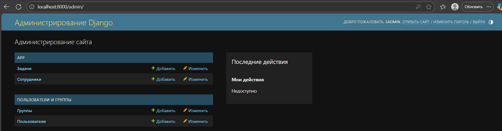
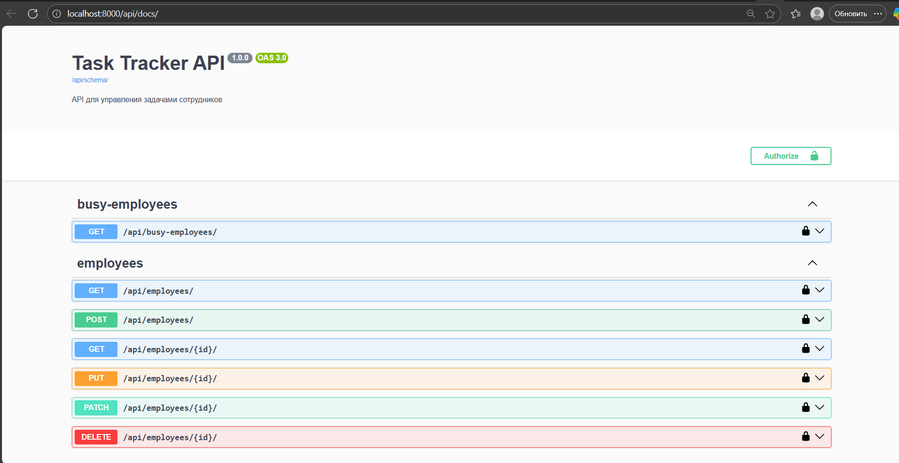
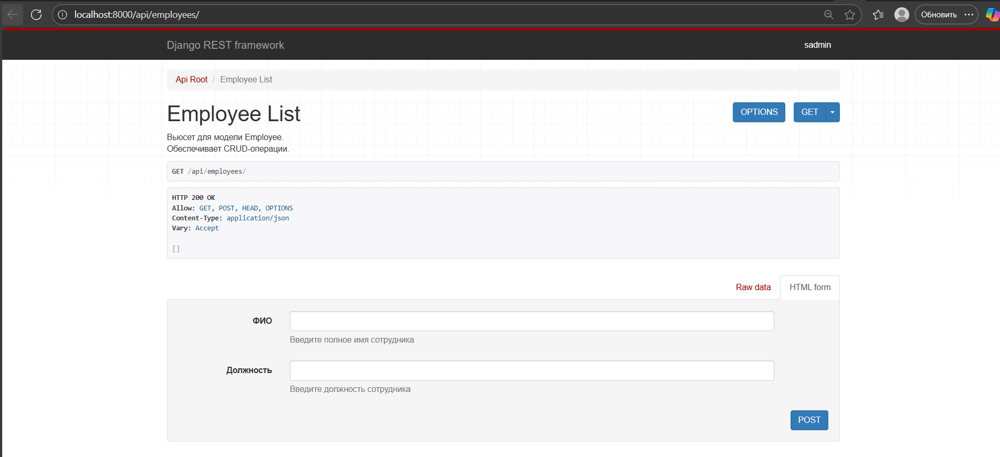
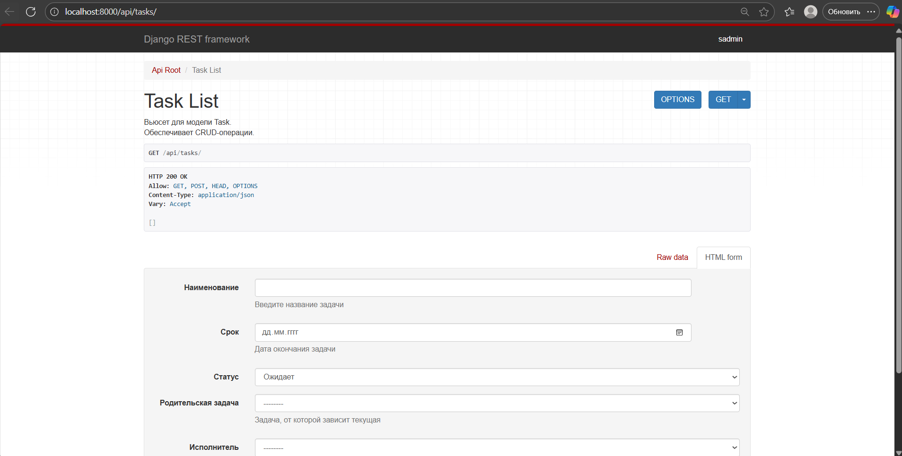

# Трекер задач сотрудников

## Заголовок

Трекер задач сотрудников — это серверное приложение для управления задачами сотрудников. Реализует CRUD-операции,
специальные эндпоинты и бизнес-логику.

---

## Описание

### Цель проекта:

Автоматизировать распределение задач, отслеживание прогресса и загруженности сотрудников в компании.

### Основные функции:

- CRUD для сотрудников и задач
- Специальные эндпоинты:
    - Получение списка сотрудников, отсортированных по количеству активных задач
    - Получение списка важных задач, которые не взяты в работу, но от которых зависят другие задачи
- Валидация данных
- Автодокументация API (Swagger)

---

## Установка

### Требования:

- Docker
- Docker Compose

### Установка и настройка:

```bash
git clone https://github.com/SarasonAndrey/tracker-tasks
cd tracker-tasks
cp .env.example .env  # Создать файл с переменными окружения
docker-compose up --build
```

# Использование

### После запуска приложение будет доступно по адресу:

```bash
    http://localhost:8000/api/docs/ — документация API (Swagger)
    http://localhost:8000/api/employees/ — список сотрудников
    http://localhost:8000/api/tasks/ — список задач
    http://localhost:8000/api/busy-employees/ — загруженные сотрудники
    http://localhost:8000/api/important-tasks/ — важные задачи
```

# Документация

### API документация автоматически генерируется с помощью drf-spectacular и доступна по адресу:

```bash
    http://localhost:8000/api/docs/
```

# Структура проекта

    tracker-tasks/
    ├── app/                    # Приложение Django
    │   ├── models.py           # Модели Employee и Task
    │   ├── serializers.py      # DRF сериализаторы
    │   ├── views.py            # DRF вьюхи
    │   ├── urls.py             # URL-ы приложения
    │   └── tests.py            # Тесты
    ├── tracker_project/        # Настройки Django
    │   ├── settings.py         # Конфигурация проекта
    │   ├── urls.py             # Корневые URL-ы
    │   └── wsgi.py
    ├── docker-compose.yml      # Конфигурация Docker Compose
    ├── Dockerfile              # Docker-образ
    ├── .env                    # Файл с переменными окружения
    ├── requirements.txt        # Зависимости
    ├── README.md               # Документация
    └── manage.py               # Django CLI

# Вклад в проект

1. Сделайте `fork` репозитория
2. Создайте ветку: ```git checkout -b feature-name```
3. Зафиксируйте изменения: ```git commit -m 'Add some feature'```
4. Отправьте ветку: ```git push origin feature-name```
5. Создайте Pull Request

# Лицензия

MIT License. См. файл LICENSE для подробностей.

# Контакты

Если у вас есть вопросы, создайте Issue в репозитории

# Скриншоты

- **Админка**
  
-
    - **Swagger UI**
      
-
    - **API сотрудников**
      
-
    - **API задач**
      
- 